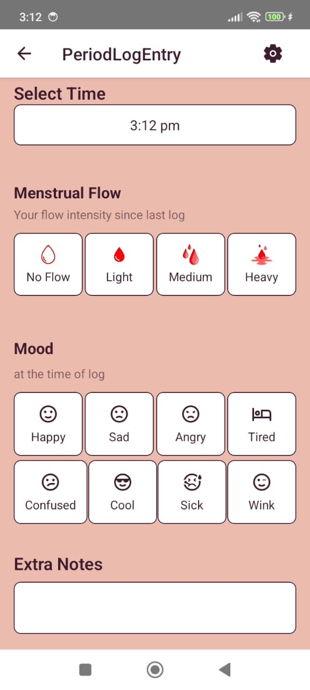
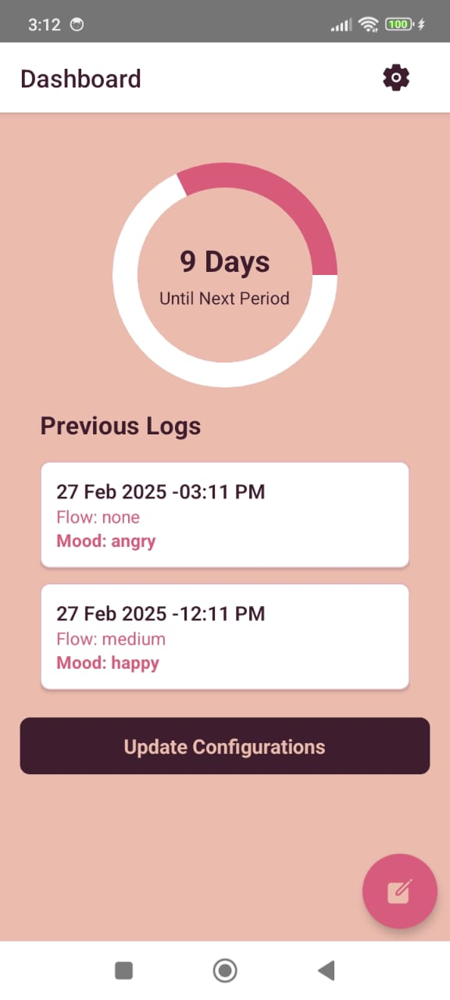
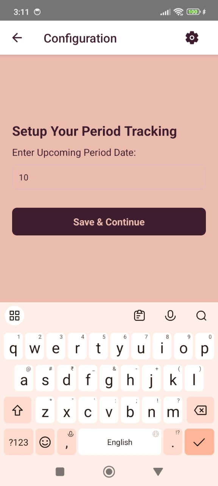
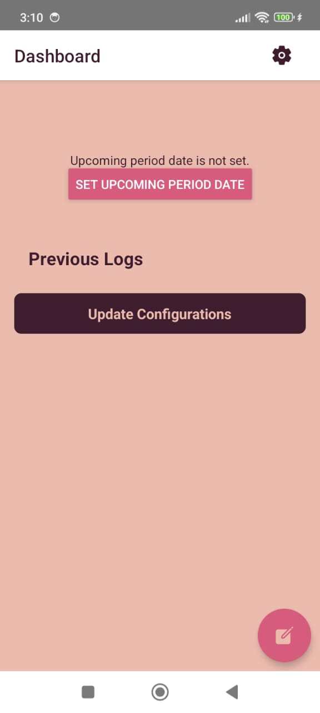
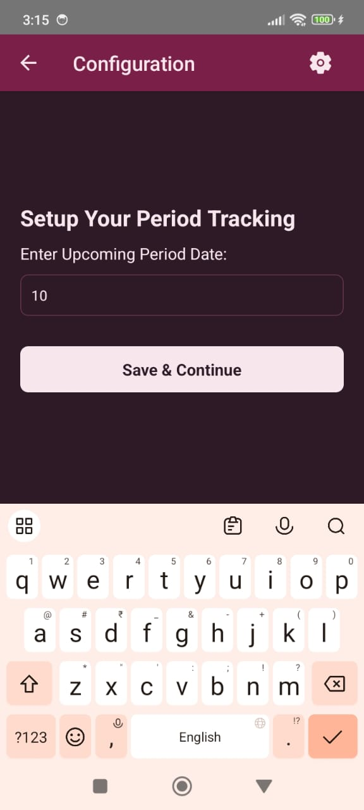
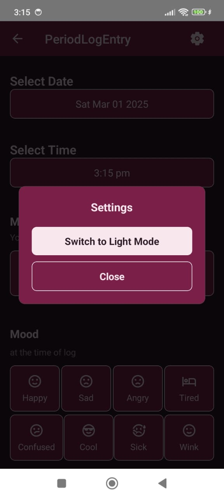
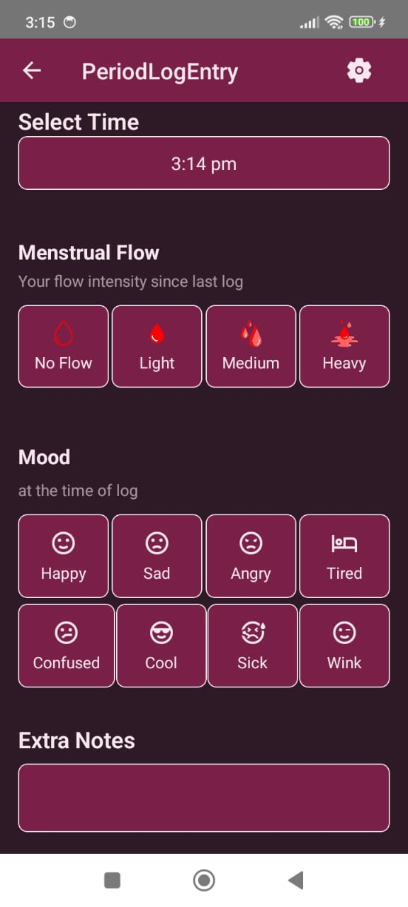
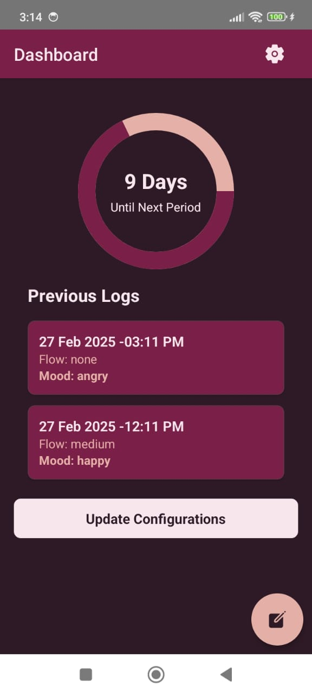

# She Health - Empowering Women's Health Tracking

## 🚀 First Release - Prototype V1

I am thrilled to introduce the **first version** of **She Health**, a mobile app designed for women to track their health with **complete privacy**. This is a proprietary project, but I want to use this opportunity to guide freshers on how to **learn in public** and share their progress effectively.

### 🌟 Why I Built This?
- I dedicated **10 hours over the weekend** to bring v1 of this idea to life.
- The goal is to **showcase the power of small, iterative progress** rather than waiting to complete a full-fledged product.
- To inspire **freshers** to document their journey and build their personal brand while learning.

### 🛠️ Tech Stack
- **TypeScript**
- **React Native** (for cross-platform mobile app development)
- **Realm** (for offline-first storage solution)

### 🔥 Features
- **No Sign-In Required** – Your data stays with you, ensuring complete privacy.
- **Offline Storage** – Store and manage your health records even without an internet connection.
- **Initial Feature Implemented:** Period Logging 📅

### 📲 Product Links
- 🔗 [PRD Link]([https://drive.google.com/file/d/1vBGniismtLc2qOYBiiP0KSPhyCP2R_Jw/view?usp=sharing](https://github.com/subraatakumar/She-Health---Public-Repo/blob/main/files/prd.md))
- Android App: [Download Here](https://drive.google.com/file/d/1vBGniismtLc2qOYBiiP0KSPhyCP2R_Jw/view?usp=sharing)
- iOS Users: Share your UID on [techcraftbysubrata](https://t.me/techcraftbysubrata) or comment below or DM me to get access for testing.

### 📸 App Screenshots

#### 🌞 Light Mode

  
  
  
  

#### 🌙 Dark Mode

  
  
  
  

---

### 👩‍💻 Message to Freshers: Learn in Public!
💡 Instead of waiting to complete an entire app, **start with a basic feature and share your progress**. Document what you build, post about challenges you face, and seek feedback.

📝 **This is only 1% of what’s required for this project.** The next features will include **multi-language support** and **activity tracking during period logging**. 

🚀 **Version 2 will be released next weekend!** Stay tuned for more updates.

💬 **To Senior Developers** – Your feedback will be invaluable in guiding freshers on how to build and improve real-world apps. Let’s create a culture of sharing and learning together!

⚡ **Stay tuned for the next update!** 💙

---

#LearnInPublic #ReactNative #TypeScript #Freshers #JobSearch #WomenHealth #Privacy #OfflineFirst

